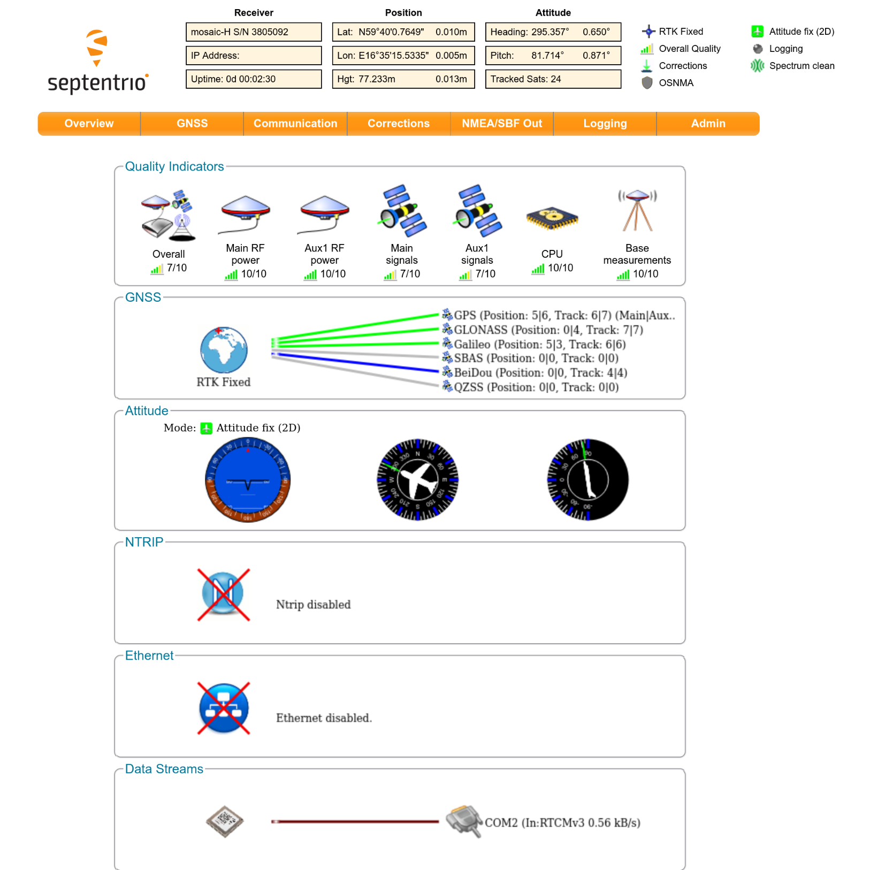

# Introduction

Septentrio is the ROS2 driver used to communicate with chipset such as Mosaic-H
used on devices like the Ardusimple RTK3B Heading. It provides all topics needed for GNSS navigation using Nav2 in ROS 2 and can handle Real-Time Kinematics (RTK) calculations using corrections data from a separate base station.

# Quick start on using GNSS with corrections from the base station on the UGV
Before using the UGV, mount the base station on a stationary location with a clear line-of-sight of both the UGV and the sky. After connecting the base station to power it should find its location and start transmitting RTK corrections to the UGV. To check if the Ardusimple RTK3B Heading is receiving these corrections please consult the web interface. 

During operations the base station should **not** be moved. 

# Connecting to the web interface on the Ardusimple RTK3B Heading

Following the tutorial from Ardusimple, it is possible to access the web interface by accessing ``192.168.3.1`` in a web browser after connecting the RTK3B Heading board to a computer. The following figure shows the landing page after connecting to the Ardusimple RTK3B Heading.



### Connecting to the web interface from a different computer
If the Ardusimple RTK3B Heading board is connected to the computer in the UGV then the connection has to be tunneled first. A simple way to tunnel is using port forwarding over ``ssh``:
```
ssh -L <local port>:192.168.3.1:80 slarc@<robot ip adress>
```
where ``<local port>`` is the local port to forward and ``<robot ip adress>`` is the ip address of the computer on the robot. An example would be 
```
ssh -L 8080:192.168.3.1:80 slarc@192.168.10.222
```
where connections to port 8080 on ``localhost``, the local computer, is forwarded to ``192.168.3.1`` on port 80 on the computer in the UGV. After connecting via ``ssh`` then the web interface should be available in a web browser at
```
127.0.0.1:8080
```

# Explanation of the RTK on the Ardusimple RTK3B Heading
Undesired delays of the GNSS signal from the satellites to the receiver caused by the different layers in the atmosphere will degrade the signal. This results in a lower accuracy of the calculated position, in most cases in the orders of multiple meters. By using a second stationary receiver observing the same satellite constellation, i.e. it is close by, it is possible to mostly compensate for these errors. In optimal conditions this may result in accuracy in the order of millimeters.

When the base station is powered on and have acquired a good enough satellite signal it can send correction data over a 2.4 Ghz radio to the Ardusimple RTK3B Heading board. Normally this takes a few minutes after a cold start. The base station has to be stationary and within line-of-sight of the Ardusimple RTK3B Heading at all times for good correction data and reception.

This should all be done without the need for user intervention. Using the web interface it is possible to confirm that RTK corrections data is received and used.

If the base station needs to be reconfigured then please refer to the [manufacturer documentation](https://www.ardusimple.com/how-to-configure-ublox-zed-f9p/). The Ardusimple RTK2B Budget should be configured as a base station, the Xbee daughter board mounted on it should not need any configuration.
