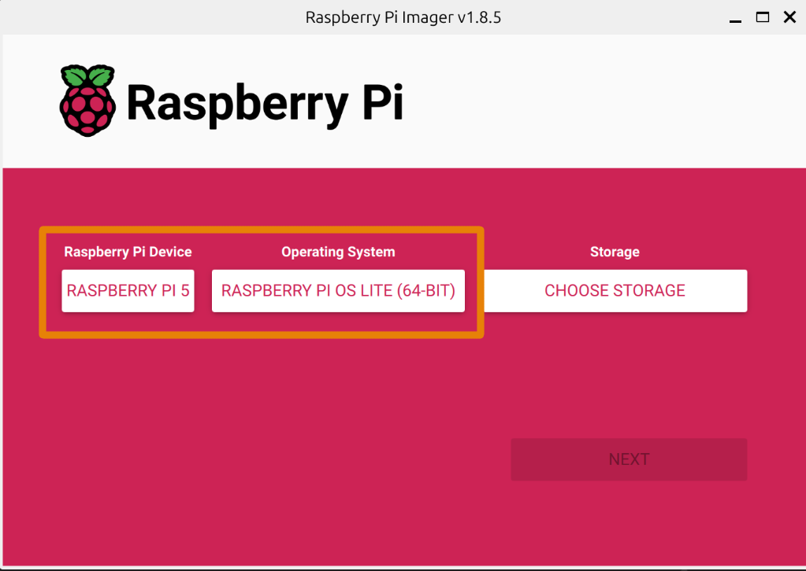
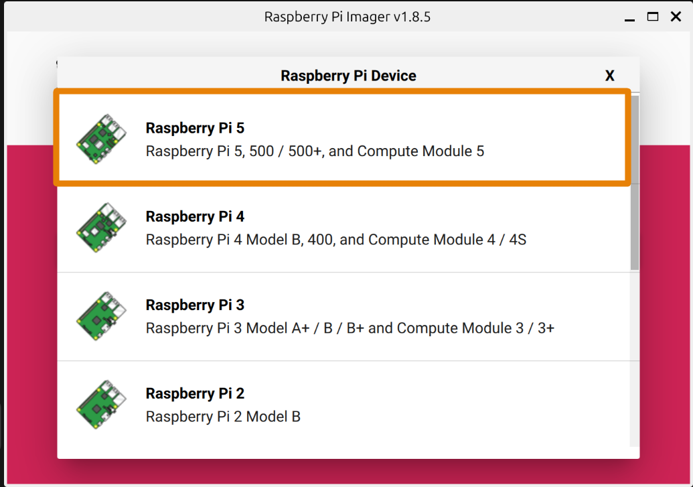
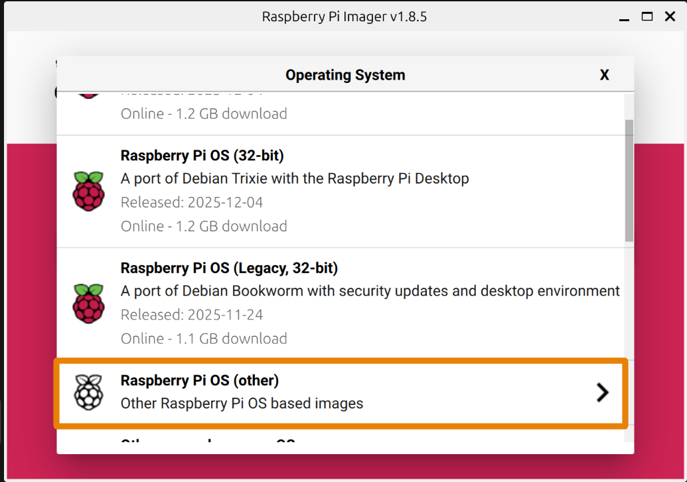
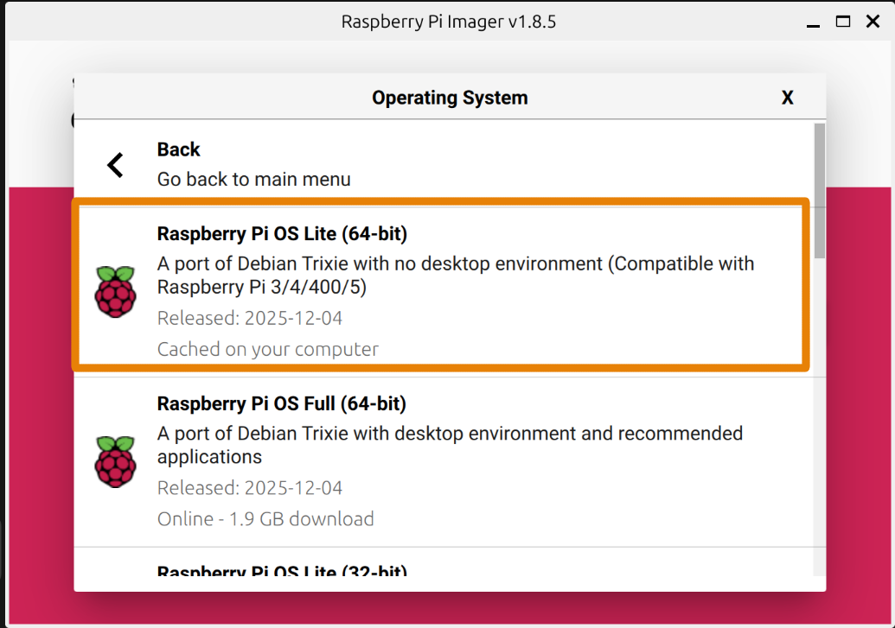
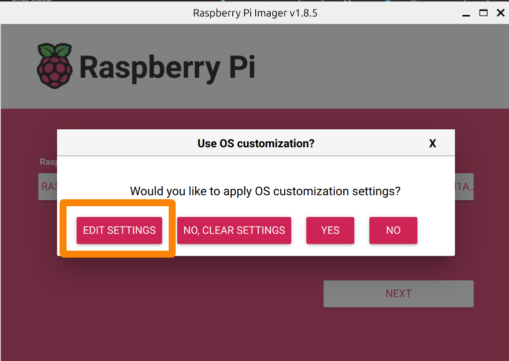
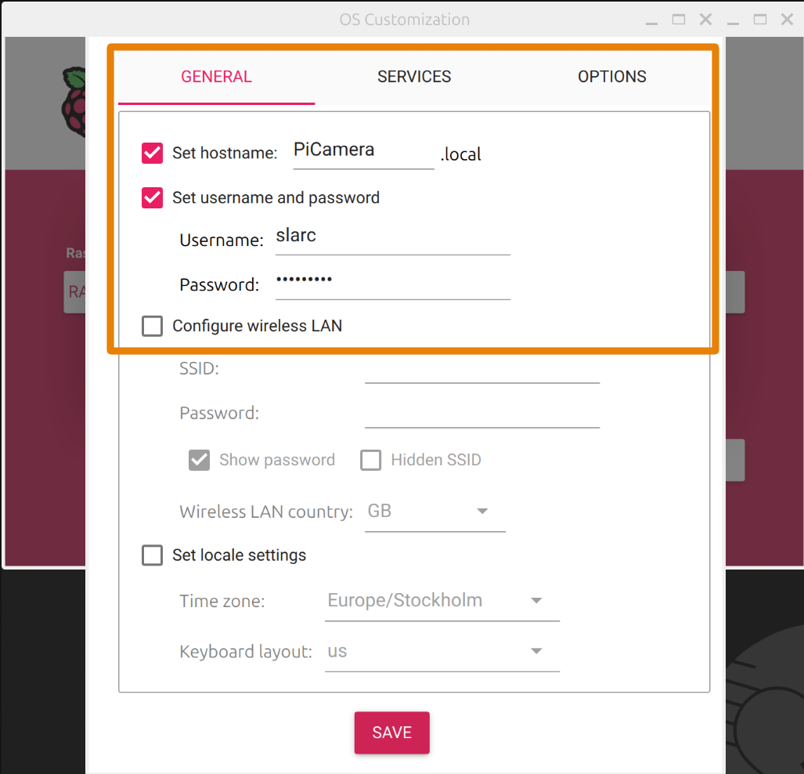
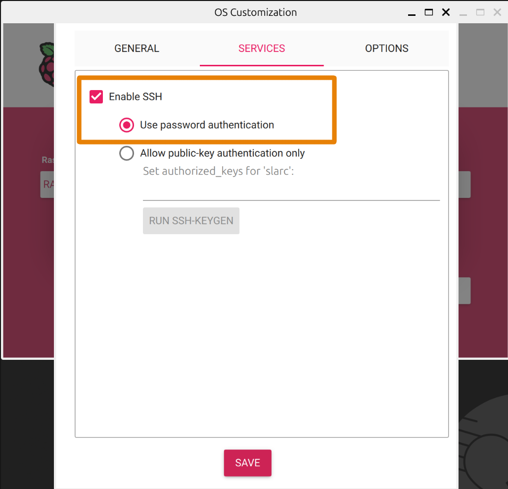
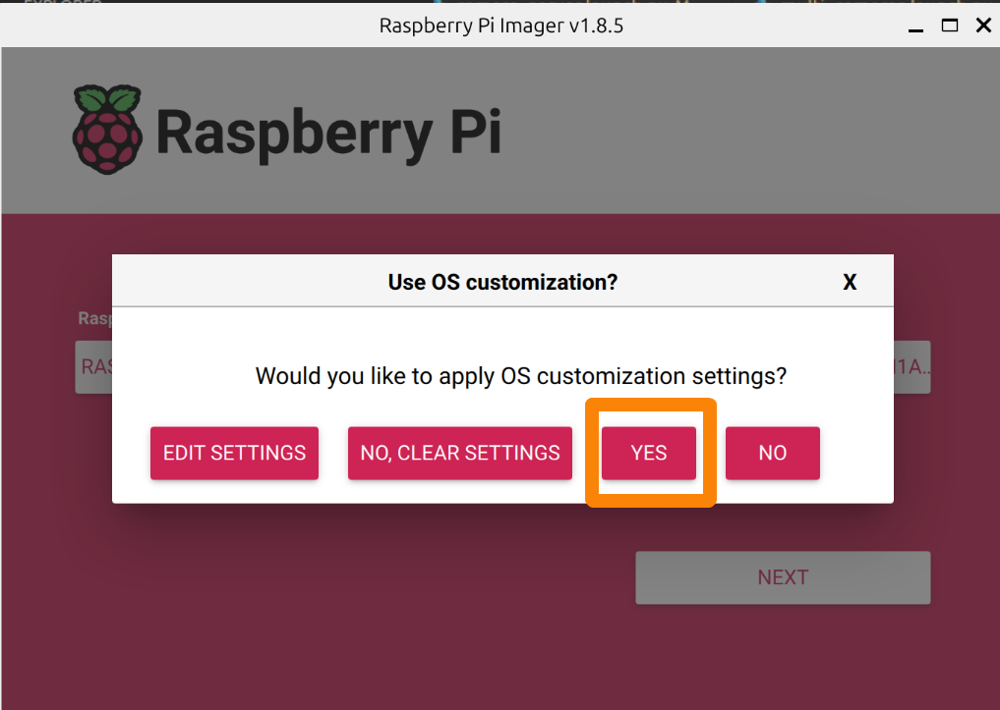
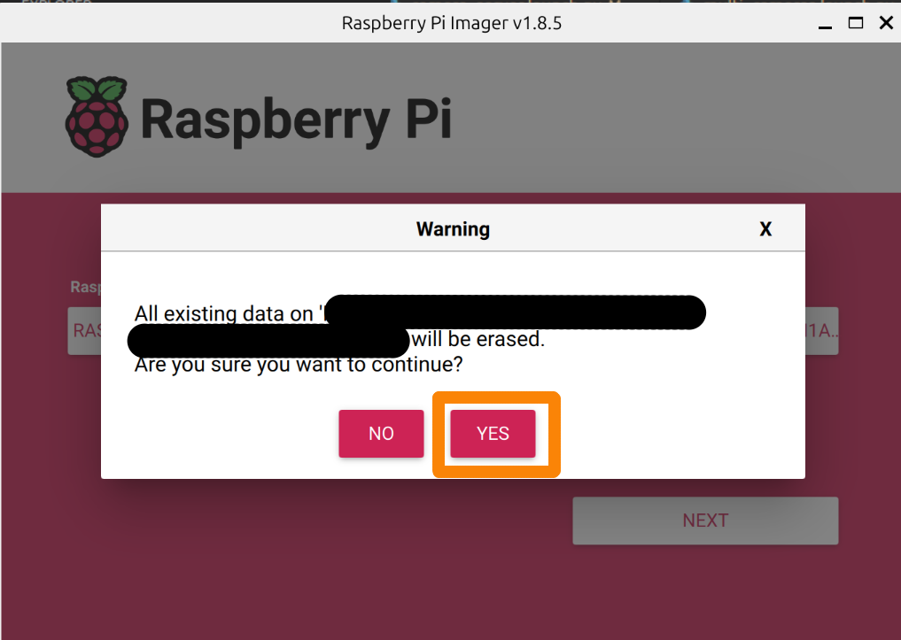

# Setting up the Raspberry Pi 5 and Pi HQ camera

Use Raspberry Pi Imager to flash Raspberry Pi OS Lite and preconfigure the Pi. Follow the screenshots in `images/` as you go.

1) Install and start Raspberry Pi Imager  
   

2) Choose device → select **Raspberry Pi 5**  
   

3) Choose OS → **Raspberry Pi OS (Other)**  
   

4) Pick **Raspberry Pi OS Lite (64-bit)**  
   

5) Choose the storage device (SD card or SSD) and click **Next**.

6) Click **Edit Settings**  
   

7) Set **General** options as shown  
   

8) Set **Services** options as shown, then click **Save**  
   

9) Confirm applying settings  
  

10) Accept the overwrite warning (all data on the selected storage will be erased)  
    

The Imager writes the image with your settings; when it finishes, eject the media and boot the Pi.

## First boot
- Insert the imaged microSD in the Pi, connect a screen and keyboard, power it on, and follow the on‑screen setup steps.

## (reserved)

## Stream setup (requirements + autostart)
1) Install dependencies:
   ```bash
   sudo apt install ffmpeg
   sudo apt install -y rpicam-apps
   ```

2) Create the streaming script at `/home/slarc/fpv_stream.sh`:
   ```bash
   nano /home/slarc/fpv_stream.sh
   ```
   ```bash
   #!/bin/bash
   set -e

   sleep 3

   exec rpicam-vid \
     --codec h264 \
     --profile main \
     --level 3.1 \
     --width 1280 \
     --height 720 \
     --framerate 30 \
     --intra 30 \
     --bitrate 3000000 \
     --inline \
     --nopreview \
     --timeout 0 \
     --libav-format h264 \
     -o - \
   | ffmpeg -nostdin -loglevel error \
     -fflags +genpts \
     -use_wallclock_as_timestamps 1 \
     -f h264 -i pipe:0 \
     -reset_timestamps 1 \
     -bsf:v h264_mp4toannexb \
     -c copy \
     -mpegts_flags +resend_headers+initial_discontinuity \
     -muxdelay 0 \
     -muxpreload 0 \
     -f mpegts \
     "udp://192.168.10.222:5600?pkt_size=1316&buffer_size=425984"
   ```

   ```bash
   chmod +x /home/slarc/fpv_stream.sh
   ```

3) Create the systemd service:
   ```bash
   sudo nano /etc/systemd/system/fpv-stream.service
   ```
   ```
   [Unit]
   Description=FPV Camera Stream
   After=network-online.target
   Wants=network-online.target

   [Service]
   Type=simple
   User=slarc
   ExecStart=/home/slarc/fpv_stream.sh
   Restart=always
   RestartSec=2
   KillSignal=SIGINT
   TimeoutStopSec=5

   Environment=LIBCAMERA_LOG_LEVELS=*:ERROR

   [Install]
   WantedBy=multi-user.target
   ```

4) Enable and start the service:
   ```bash
   sudo systemctl daemon-reexec
   sudo systemctl daemon-reload
   sudo systemctl start fpv-stream.service
   ```

5) Check logs:
   ```bash
   journalctl -u fpv-stream.service -f
   ```
