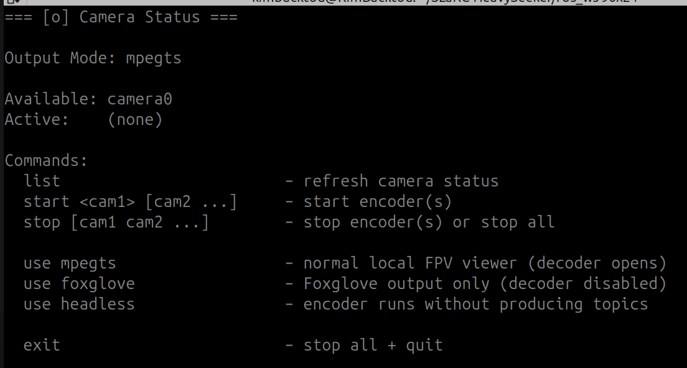
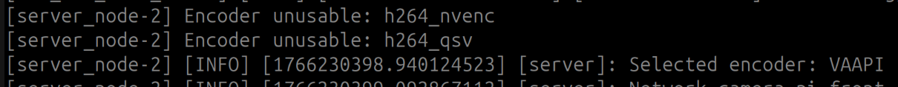
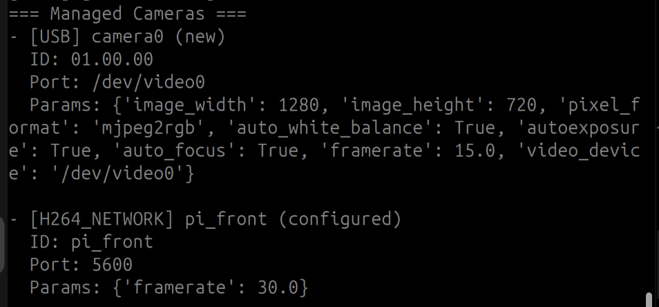

# s_cameras – FPV camera stack

ROS 2 package that detects cameras, launches the right drivers, and serves H.264 FPV streams to a CLI viewer. It covers USB webcams, OAK/DepthAI devices, and H.264 network cameras (for example, a Pi streaming over UDP/TCP).

## What it does
- Discovers cameras (`init_cameras`) with `CameraManager`: scans USB (`usb_cam`), DepthAI, and any `h264_network` entries in `config/cameras.yaml`. Names are auto‑assigned (`camera0`, `oak0`, …) and merged with YAML overrides.
- Brings up drivers (`launch/multi_cameras.launch.py`): starts `usb_cam` for USB and DepthAI launch for OAK. Network cameras are left for the server to handle.
- Runs a server (`camera_server`): chooses an encoder (NVENC/QSV/VAAPI/CPU), exposes actions to start/stop cameras, and republishes network H.264 streams through `NetworkTSReceiver`.
- Provides a client (`fpv_client`): CLI to list/start/stop cameras and view streams. Uses `decoder.py` for the windowed viewer and supports Foxglove/headless modes.

## Architecture
- **Server node**: `camera_server` (`server_node` executable).
  - Parameters: `cameras_json` (populated from `CameraManager`), `encoder.*` tuning flags (bitrate, gop, etc.).
  - Services: `get_available_cameras` (`s_msgs/srv/GetCameras`) reports detected cameras and encoders; `set_output_mode` (`s_msgs/srv/SetOutputMode`) switches `mpegts|foxglove|headless`.
  - Actions: `start_camera_encoding` / `stop_camera_encoding` (`s_msgs/action/StartCamera`, `StopCamera`) to start/stop encoders or network receivers.
  - Topics: `/{name}/encoded/{codec}` (MPEG‑TS as `CompressedImage`); optional `.../foxglove` (`CompressedVideo`) in foxglove mode. Network cameras reuse the same layout via `NetworkTSReceiver`.
  - Registry: `CameraRegistry` tracks heartbeats and maps camera name → input topic for local cameras; network cameras are registered so clients can find them even if they stream over UDP/TCP.

## Encoders and output modes
- Local cameras: `CameraEncoder` converts raw ROS images to H.264 (MPEG‑TS). Resolution follows the camera’s native size.
- Network cameras: `NetworkTSReceiver` pulls the H.264 TS from the URL, infers resolution, and republishes. In `foxglove` mode it also converts TS→Annex‑B.
- Output modes (client command `use <mode>`):
  - `mpegts`: default viewer window.
  - `foxglove`: publish Annex‑B for Foxglove.
  - `headless`: no local viewer.

## Configuring cameras
- File: `src/s_cameras/config/cameras.yaml` (installed to the share directory).
- Sections:
  - `usb_cameras`: per‑ID overrides; defaults in code are 1280x720 @ 30 fps with auto exposure/focus/AWB.
  - `oak_cameras`: DepthAI parameters (see `config/README.md` for the full list).
  - `h264_network_cameras`: name → `{url, port?, params}`. Width/height are optional; the receiver infers resolution. `framerate` is metadata (defaults to 30 if missing).
- USB/OAK matches by device IDs/MxID; network cameras match by name.

## Run the stack
- Build: `colcon build --packages-select s_cameras` and source the workspace.
- Launch drivers + server: `ros2 launch s_cameras cameras.launch.py`
- Start the client: `ros2 run s_cameras fpv_client`
  - Handy commands: `list`, `start <cam...>`, `stop`, `use mpegts|foxglove|headless`, `exit`.

## Client notes
- `fpv_client.py` drives the CLI, calls server services/actions via `client_service.py`, and manages the decoder with `image_decoder.py`.
- `decoder.py` consumes `CompressedImage` MPEG‑TS topics, decodes with ffmpeg, and shows a resizable OpenCV window; supports multiple cameras side‑by‑side with bandwidth/FPS overlays.
- Typical flow: `list` → `start camera0` → viewer opens; `use foxglove` to switch output; `stop` to stop all.

## Visual guide
- FPV client CLI:  
    
  Commands: `list` (shows available cameras and which are active), `start <cam...>` to begin streaming, `use mpegts|foxglove|headless` to switch output mode, `stop` to stop active cameras (or just the decoder if none are active), `exit` to quit.
- Encoder selection:  
    
  On server launch, encoders are probed (NVENC, QSV, VAAPI, then CPU). “Selected VAAPI” (or NVENC/QSV) means hardware acceleration is in use. If it falls back to `libx264`, no GPU encoder was detected or drivers are missing; it works but will load the CPU heavily—install the correct GPU drivers if possible.
- Managed cameras:  
    
  Shows detected USB/OAK cameras and configured network cameras. Entries marked “new” lack a known ID/serial or are not yet in `cameras.yaml`. When a serial/ID is shown, add it to the YAML to lock names/params.

## Requirements
- ROS 2 (tested with Jazzy) with `usb_cam` and `depthai_ros_driver` installed.
- ffmpeg on the host; encoder selection is automatic.
- Hardware encoders supported: NVIDIA (NVENC), Intel (QSV/VAAPI), or CPU fallback.
- Network cameras must stream H.264 TS at the configured URL.

## Installation (Jazzy)
Install package dependencies and tools:
```bash
sudo rosdep install --from-paths src --ignore-src --rosdistro jazzy -r -y
sudo pip install depthai --no-deps --force-reinstall --break-system-packages
sudo apt install ffmpeg
```
- Note: build `s_msgs` (in this workspace) before `s_cameras` since the server and client use its actions and services.
